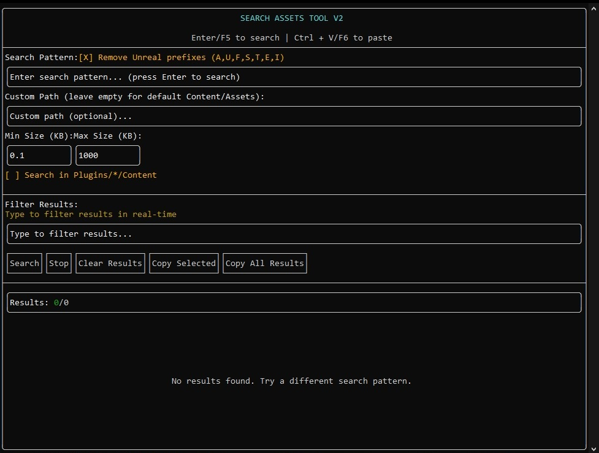

# Asset Search Tool V2 Turbo compressed (C++ Multithreaded)

A high-performance C++ version of the PowerShell asset search tool with modern terminal UI using ftxui.


## Features

- **Multithreaded search** for maximum performance
- **Modern terminal UI** with real-time progress updates
- **Regex pattern matching** with case sensitivity options
- **Recursive directory traversal** through Content/Assets and Plugin directories
- **Real-time results display** as files are processed
- **Interactive keyboard shortcuts** for efficient workflow

## Requirements

- **C++20** compatible compiler (GCC 10+, Clang 12+, MSVC 2019+)
- **CMake 3.20** or newer
- **Git** (for downloading dependencies)
- Internet connection for first build (to download ftxui)

## Building

### Windows (Visual Studio)

```cmd
mkdir build
cd build
cmake .. -G "Visual Studio 17 2022" -A x64
cmake --build . --config Release
```

### Windows (MinGW)

```cmd
mkdir build
cd build
cmake .. -G "MinGW Makefiles" -DCMAKE_BUILD_TYPE=Release
cmake --build .
```

### Linux/macOS

```bash
mkdir build
cd build
cmake .. -DCMAKE_BUILD_TYPE=Release
make -j$(nproc)
```

## Usage

Run the executable:

```bash
./SearchAssets
```

### Interface Controls

- **Tab/Shift+Tab**: Navigate between input fields
- **Enter**: Execute search when in search pattern field
- **F5**: Start search from anywhere
- **Escape**: Stop running search
- **q**: Quit application (when not searching)
- **Arrow Keys**: Navigate through results list

### Search Options

1. **Search Pattern**: Regex pattern to search for
2. **Custom Path**: Optional custom directory (defaults to Content/Assets)
3. **Search in Plugins**: Include Plugins/\*/Content directories
4. **Case Sensitive**: Enable case-sensitive matching

## Architecture

### Multithreaded Design

- **Thread Pool**: Utilizes all available CPU cores
- **Producer-Consumer**: Efficient work distribution
- **Lock-Free Progress**: Atomic operations for UI updates
- **Batch Processing**: Groups files for optimal load balancing

### Performance Features

- **std::filesystem**: Fast directory traversal
- **std::regex**: Optimized pattern matching
- **Asynchronous I/O**: Non-blocking file operations
- **Memory Efficient**: Streams large files without loading entirely

## Troubleshooting

### Runtime Issues

- Verify directory permissions for target search paths
- Large result sets may slow UI updates (this is normal)
- Press Escape to stop long-running searches
